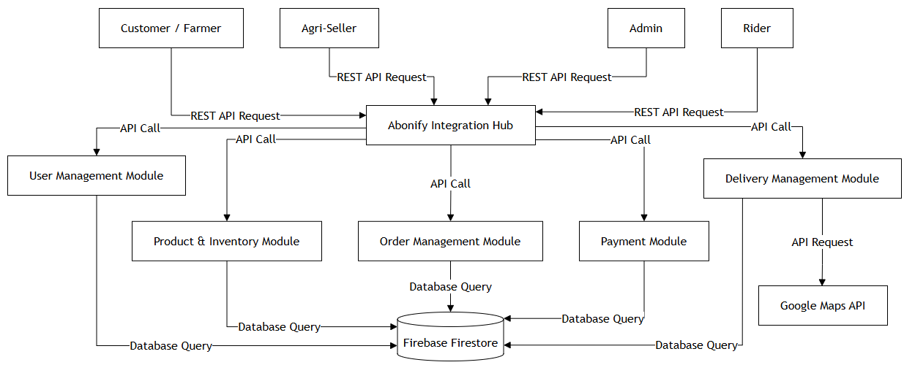

# Project Overview

## 1. System Objectives

Abonify aims to provide an agricultural supply e-commerce and delivery system for local farmers, growers, and agri-shops. The system will help users find and purchase organic and inorganic fertilizers while providing clearer product prices and delivery coordination. It will also help agri-sellers manage their products and orders in one platform.

## 2. Proposed Scope

The project will integrate the following modules:

* User and role management for Customers/Farmers, Agri-Sellers, Riders, and Admin.
* Product and fertilizer inventory management.
* Product browsing and ordering.
* Order management with order status updates.
* Payment options such as Cash on Delivery and GCash payment proof.
* Delivery coordination for fertilizer orders.
* Data storage using Firebase Firestore.
* REST API integration for selected external services.

### In-Scope Features

* User registration and login
* Fertilizer product management
* Product browsing
* Shopping cart and ordering
* Order status management
* Seller inventory management
* Payment proof submission
* Delivery coordination
* Integration with external services where needed

### Out-of-Scope

* Actual physical delivery operations
* Direct control of banking or payment systems
* Large-scale logistics management
* Advanced features that are not required for the current project

## 3. Stakeholders

* **Customer/Farmer** — Needs an easier way to find, compare, and order fertilizer products.
* **Agri-Seller** — Needs to manage fertilizer products, inventory, prices, and customer orders.
* **Rider** — Needs access to delivery information and assigned orders.
* **System Administrator** — Manages users, system data, and overall platform operations.

## 4. Tools & Technologies

* **Languages/Frameworks:** React, Vite, TypeScript/TSX
* **Database/Storage:** Firebase Firestore
* **Development Environment:** Visual Studio Code
* **Version Control:** Git and GitHub
* **Integration Approach:** REST APIs and other appropriate API-based integrations
* **External Services:** Google Maps
* **Testing Tools:** Postman and browser developer tools

---

# HIGH LEVEL SYSTEM OVERVIEW

## System Overview

**Abonify** is a multi-sided e-commerce and logistics platform that connects local farmers and gardeners with accredited agricultural supply merchants and independent delivery couriers. The platform streamlines fertilizer procurement, supports delivery coordination for agricultural supplies, and provides intelligent crop-care guidance.

---

## 1. Major Modules / Subsystems

### 1.1 Marketplace, Cart & Order Fulfillment Subsystem

This subsystem enables customers to search, filter, and purchase fertilizers, including organic fertilizers, chemical fertilizers, and soil conditioners from local agricultural supply stores. It manages cart aggregation, delivery location selection, and order status transitions from **Pending**, **Preparing**, **Ready for Pickup**, **In Transit**, to **Delivered**.

For agri-sellers, the subsystem supports product listing management, inventory monitoring, critical stock alerts, and the generation of printable inventory reports and sales documents.

### 1.2 Logistics & Geolocation Subsystem

This subsystem manages the delivery process for motorcycle and utility vehicle riders. It provides available delivery jobs, supports rider assignment, calculates routes between merchant locations and customer delivery locations using digital maps, and tracks delivery progress.

It also supports **Proof of Delivery (POD)** through photo uploads before an order is marked as delivered.

---

## 2. External Systems & Interfaces

### 2.1 Google Maps Platform

The Google Maps Platform provides geospatial services for the system. It supports address geocoding, delivery location coordinates, map-based location selection, and route generation for delivery riders.

### 2.2 Payment Gateway Interface

The Mock GCash subsystem simulates a mobile e-wallet payment workflow. It supports transaction reference numbers, payment verification, and the submission of payment receipt screenshots.

### 2.3 jsPDF Document Engine

The jsPDF library provides client-side document generation for inventory summaries and sales-related reports. It allows the system to generate printable PDF documents without requiring server-side document rendering.

### 2.4 Firebase / Firestore

Firebase Firestore serves as the cloud persistence layer for the system. It stores system data such as user records, product information, order records, and delivery logs.

---

## 3. Data Flow Summary

Data movement within Abonify follows the activities of its four principal stakeholder roles: **Customer, Seller, Rider, and Administrator**.

### 3.1 Catalog Setup & Seller Accreditation

An agri-shop registers and submits its account and business information. The Administrator reviews the submitted information and approves or rejects the seller account. Once approved, the seller can create and manage fertilizer product listings, which are stored in the product catalog.

### 3.2 Ordering

The farmer can then browse products, add items to the cart, select a delivery location using the map interface, and proceed with checkout using the available payment options.

### 3.3 Fulfillment & Inventory Adjustment

After an order is placed, the system records the transaction and updates the relevant inventory information. The seller receives the order information and can update the order status through the fulfillment process:

**Pending → Preparing → Ready for Pickup**

### 3.4 Logistics & Delivery

When an order is ready for pickup, it becomes available to riders for delivery assignment. The assigned rider receives the delivery information and route details generated through the mapping service.

The rider updates the delivery status to **In Transit** and submits a Proof of Delivery photo after completing the delivery. The order is then marked as **Delivered**.

### 3.5 Auditing & History

Completed transactions are reflected in the appropriate records and user histories. The system maintains information related to customer orders, seller transactions, rider delivery activities, and administrative audit records.

---

## INTEGRATION PATTERN APPLIED

### Integration Pattern Applied
**Hub-Spoke**

### Rationale
The Hub-Spoke pattern was selected for Abonify because the system has several modules that need to exchange information. The Abonify Integration Hub serves as the central point that routes communication between users and the system modules. This reduces the need for direct connections between every module and keeps the communication more organized. It also allows modules such as User Management, Product & Inventory, Order Management, Payment, and Delivery Management to work together through a central integration point.

### Diagram Reference

**Draw.io Diagram:** [Open the editable diagram](https://drive.google.com/file/d/1GjPn6iHX3g-7uUCsWLmcWSYGMu67fc1d/view?usp=sharing)

## Messaging Workflow

Abonify uses a simple in-memory message queue prototype to demonstrate asynchronous communication between the Order Module and the Approval Module. The Order Module acts as the producer by submitting order requests to the message queue. Each request contains the customer name, product ID, quantity, and total amount.

The Approval Module acts as the consumer by retrieving the order requests from the queue and processing them one by one. For this prototype, an order with a total amount of ₱50,000 or below is marked as Approved, while an order above ₱50,000 is marked as Rejected. This threshold is used only for demonstrating the messaging workflow and is not an existing Abonify business rule.

The messaging flow is:

Order Module → Message Queue → Approval Module → Approval Decision

This prototype demonstrates how modules can communicate asynchronously through a message queue without directly depending on each other's processing. The middleware implementation is located in `/integration/middleware`.
